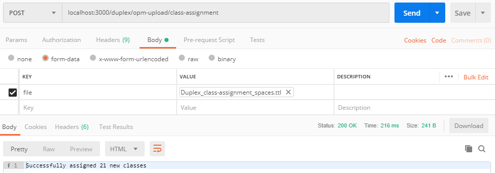
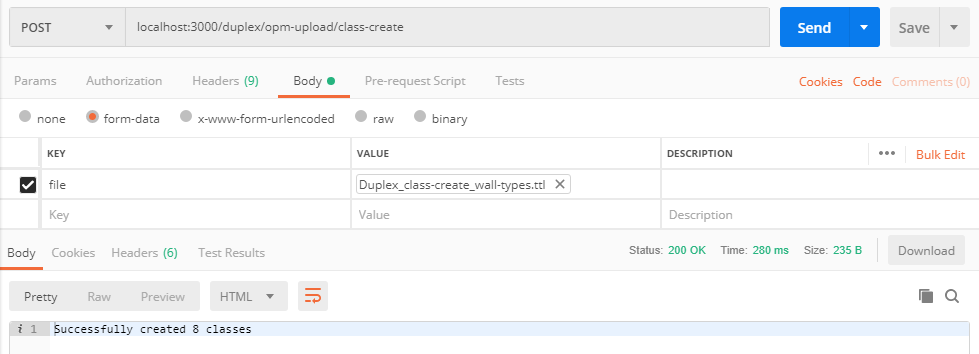
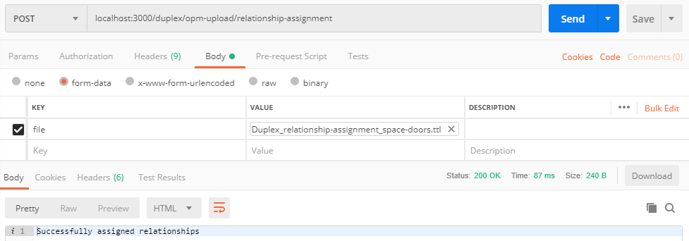

## Content


### 1. /:projectNumber/opm-upload/class-assignment
A POST request to this route with a turtle file as payload is accepted.

An optional *dsURI* query parameter can be provided (/:projectNumber/opm-upload/class-assignment?dsURI=:dsURI). This Data Source URI is a URI which defines the data source from which the batch of class instances came (for example a Revit model). This is used in cases where multiple data sources are synced on OPM-REST. This way, it is possible to tell which data source the data came from, and further it is possible to see if something is missing compared to what once was coming from the same data source. If an instance exists in the store but is not part of the new incoming batch, it will be marked as deleted (see below).

The expected triple format is:

```turtle
<el> a <someClass> .
```

The triples are inserted in a temporary graph in the Fuseki dataset (matched by `:projectNumber` query parameter). It is checked if the resource already exists and if so, it is skipped. If not, it is inserted and a time stamp is assigned to it.

```turtle
<el> a <someClass> ;
    prov:generatedAtTime "currentTime"^^xsd:dateTime ;
    opm:sourceID "someID" .
```

Deleted triples will not be removed from the store but the following information will be added:

```turtle
<el> a opm:Deleted ;
    prov:invalidatedAtTime "currentTime"^^xsd:dateTime .
```

Instances that were previously seen, were not seen in a period, and are then seen again will be restored simply by removing the *opm:Deleted* and invalidation time.



### 2. /:projectNumber/opm-upload/property-assignment
A POST request to this route with a turtle file as payload is accepted. The expected triple format is:

```turtle
<el> <someProperty> "someValue"^^<someDatatype> .
```

The triples are inserted in a temporary graph in the Fuseki dataset (matched by `:projectNumber` query parameter). It is checked if the property has already been assigned to the resource. If the property doesn't already exist, a new property and property state is generated (URIs generated automatically).

```turtle
<el> <someProperty> <generatedPropertyURI> .
<generatedPropertyURI> opm:hasPropertyState <generatedPropertyStateURI> .
<generatedPropertyStateURI> a opm:CurrentPropertyState , opm:InitialPropertyState ;
    prov:generatedAtTime "currentTime"^^xsd:dateTime ;
    schema:value "someValue"^^<someDatatype> .
```

If the property exists it is checked if the value has changed. If so, the `opm:CurrentPropertyState` from the most recent property state is replaced with a `opm:OutdatedPropertyState` and a new property state is generated (URI generated automatically).

```turtle
<existingPropertyURI> opm:hasPropertyState <generatedPropertyStateURI> .
<generatedPropertyStateURI> a opm:CurrentPropertyState ;
    prov:generatedAtTime "currentTime"^^xsd:dateTime ;
    schema:value "someValue"^^<someDatatype> .
```

If the value hasn't changed, the property is skipped.

### 3. /:projectNumber/opm-upload/class-create
A POST request to this route with a turtle file as payload is accepted. The expected triple format is:

```turtle
<class> a owl:Class ;
    rdfs:subClassOf <someClass> .
```

If the class doesn't already exist it is created.

An optional *dsURI* query parameter can be provided (see section 1) and if this is present, it will also be possible to mark deleted classes:
```turtle
<class> a opm:Deleted ;
    prov:invalidatedAtTime "currentTime"^^xsd:dateTime .
```

Classes that were previously seen, were not seen in a period, and are then seen again will be restored simply by removing the *opm:Deleted* and invalidation time.



### 4. /:projectNumber/opm-upload/relationship-assignment
A POST request to this route with a turtle file as payload is accepted. The expected triple format is:

```turtle
<a> <someRelation> <b> .
```

Nothing special happens. The triples are simply inserted in the Fuseki dataset (matched by `:projectNumber` query parameter).



### 5. /:projectNumber/opm-upload/class-property-assignment
A POST request to this route with a turtle file as payload is accepted. The expected triple format is:

```turtle
<class> <someProperty> "someValue"^^<someDatatype> .
```

The triples are inserted in a temporary graph in the Fuseki dataset (matched by `:projectNumber` query parameter). It is checked if the property has already been assigned to the class. If the property doesn't already exist, a new property restriction, property and property state is generated (URIs generated automatically).

```turtle
<class> rdfs:subClassOf <generatedRestrictionURI> .
<generatedRestrictionURI> a owl:Restriction ;
    owl:onProperty <someProperty> ;
    owl:hasValue <generatedPropertyURI> .
<generatedPropertyURI> opm:hasPropertyState <generatedPropertyStateURI> .
<generatedPropertyStateURI> a opm:CurrentPropertyState , opm:InitialPropertyState ;
    prov:generatedAtTime "currentTime"^^xsd:dateTime ;
    schema:value "someValue"^^<someDatatype> .
```

If the property exists it is checked if the value has changed. If so, the `opm:CurrentPropertyState` from the most recent property state is replaced with a `opm:OutdatedPropertyState` and a new property state is generated (URI generated automatically).

```turtle
<existingPropertyURI> opm:hasPropertyState <generatedPropertyStateURI> .
<generatedPropertyStateURI> a opm:CurrentPropertyState ;
    prov:generatedAtTime "currentTime"^^xsd:dateTime ;
    schema:value "someValue"^^<someDatatype> .
```

If the value hasn't changed, the property is skipped.
