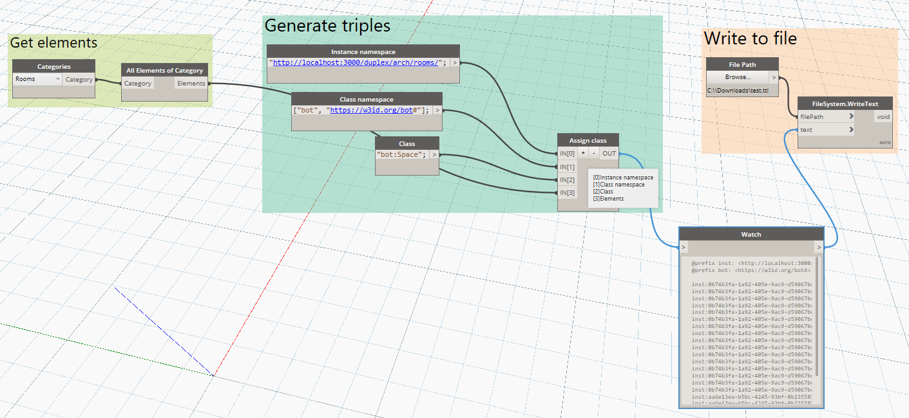
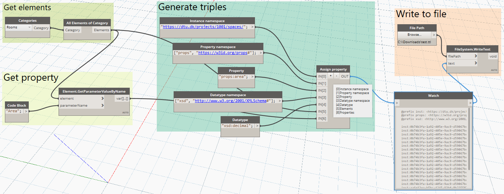
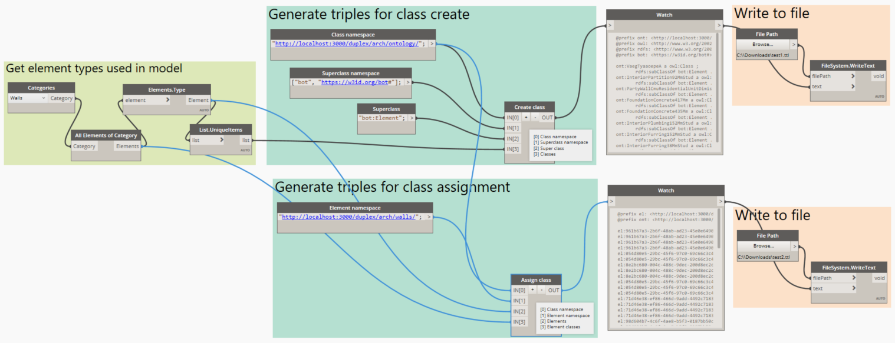
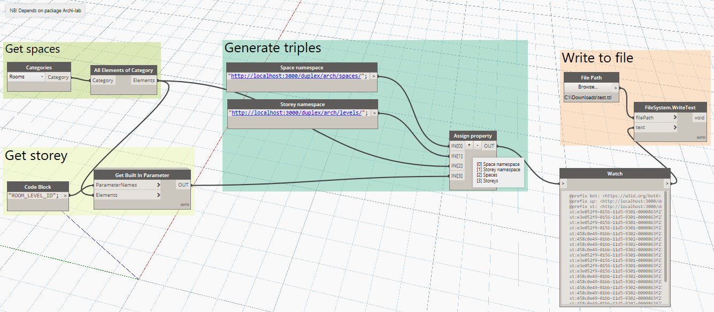
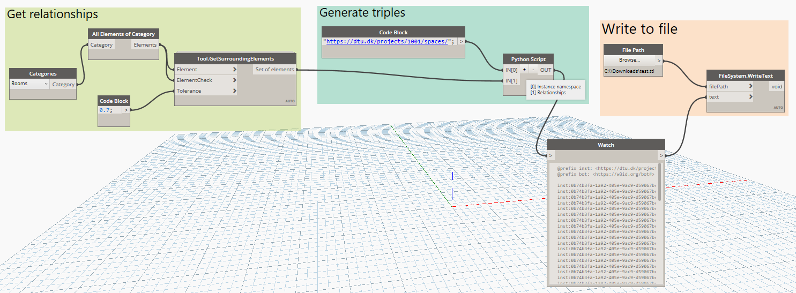
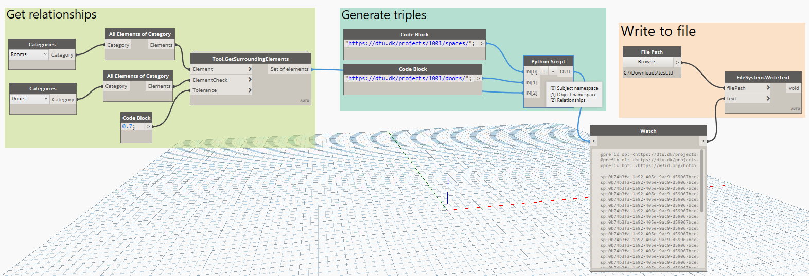
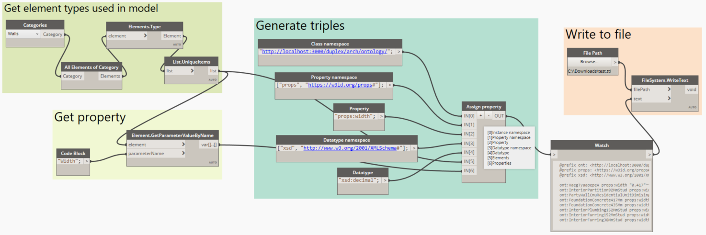
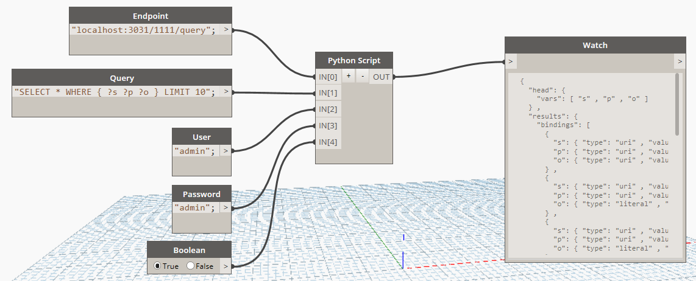

## Content
This folder contains a set of Dynamo scripts that can be used to extract BOT-compliant LBD-triples from a Revit model. The scripts generate triples that can be sent to OPM-REST API through POST requests. They can be divided into three categories, which the API treats differently.
All scripts generate URIs in the form:

Instance:   `{prefix}:{RevitGUID}`
Class:      `{prefix}:{RevitTypeName}` (special characters removed and converted to PascalCase)

The prefix can be set to anything but for them to work with the OPM-REST API, it should have the following form:

Instance:   `{host}/{projectNumber}/{discipline}/{type}/{id}`
Class:      `{host}/{projectNumber}/{discipline}/ontology/{ClassName}`

| Item          | Description                                                               | Example                  |
| ------------- |:------------------------------------------------------------------------- | ------------------------ |
| host          | The host address of the OPM-REST server including the protocol.           | http://niras.dk/projects |
| projectNumber | The project number. This is also the name of the dataset on Fuseki.       | 105519                   |
| discipline    | The discipline of the creator of the data (the source of the information) | arch / hvac / ict        |
| type          | The type of the resource in plural. For Revit exports, use the Revit type name. | rooms / properties / states / levels |
| id            | The id can in practice just be a running number for each particular kind of item but for easier reference, the Revit GUID is preferred. | 2c391822-07f8-4a22-86a8-a1e574103a53-0002dd93 |
| ClassName     | The class name must be unique. The Dynamo scripts generate these by 1) replacing "æ,ø,å" with "ae,oe,aa" 2) making it PascalCase 3) removing spacial characters and 4) URL encoding to be absolutely sure that it will be a valid URI |

Examples:
Instance:   `http://niras.dk/projects/105519/arch/walls/2c391822-07f8-4a22-86a8-a1e574103a53-0002dd93`
Class:      `http://niras.dk/projects/105519/arch/ontology/HeavyWall`

### 1. class-assignment
The `class-assignment.dyn` Dynamo script does the following:

1. Extract Revit elements of a certain category
2. Generate triples in the form `<sp> a bot:Space` (`inst:xx rdf:type bot:Space`)
3. Write triples to file



Example files generated with this script located in `data/sample_data`:

* Duplex_class-assignment_spaces.ttl
* Duplex_class-assignment_walls.ttl

### 2. property-assignment
The `property-assignment.dyn` Dynamo script does the following:

1. Extract Revit elements of a certain category
2. Get a specific property of these elements
3. Generate triples in the form `<el> <prop> "value"^^<datatype>`
4. Write triples to file



Example files generated with this script (and `space-boundaries-WKT.dyn`) located in `data/sample_data`:

* Duplex_property-assignment_space-floor-area.ttl
* Duplex_property-assignment_space-boundaries-WKT.ttl

### 3. class-create
Revit Family Types such as specific wall types or window types are treated as project specific OWL classes. This means that in addition to being a bot:Element a wall is also a proj:revitType. Extracting Revit Family Types as OWL classes and assigning instances of this family to the class is handled in the `class-create.dyn` Dynamo script.

The `class-create.dyn` Dynamo script does the following:

1. Extract Revit elements of a certain category
2. Get the types of these elements
3. Generate triples in the form `<cl> a owl:Class ; rdfs:subClassOf bot:Element .`
4. Generate triples in the form `<el> a <cl> .`
5. Write triples to file



Example files generated with this script located in `data/sample_data`:

* Duplex_class-create_wall-types.ttl
* Duplex_class-assignment_wall-types.ttl

### 4. relationship-assignment
For relationship assignment it is hard to make a one size fits all but the `space-storey.dyn`, `space-adjacency.dyn` and `space-element-adjacency.dyn` demonstrate how it can be handled.

The `space-storey.dyn` Dynamo script does the following:

1. Extract Revit rooms
2. Get the levels on which they are located (requires Archi-lab package)
3. Generate triples in the form `<st> bot:hasSpace <sp> .`
4. Write triples to file



The `space-adjacency.dyn` Dynamo script does the following:

1. Extract Revit rooms
2. Get adjacencies between these (simplified method using bounding box)
3. Generate triples in the form `<sp1> bot:adjacentZone <sp2> .`
4. Write triples to file



The `space-element-adjacency.dyn` Dynamo script does the following:

1. Extract Revit rooms
2. Extract Revit elements of a certain category
3. Get adjacencies between these (simplified method using bounding box)
4. Generate triples in the form `<sp> bot:adjacentElement <el> .`
5. Write triples to file



### 5. class-property-assignment
Class properties are extracted in a similar way as instance properties except that the Python script retrieves and processes the class name. The OPM-REST API also treats them differently as they are assigned as OWL property restrictions.

The `class-property-assignment.dyn` Dynamo script demonstrates how this is done wor wall types.



Example file generated with this script located in `data/sample_data`:

* Duplex_class-properties_wall-type-width.ttl

### Read from store in Revit

There might be situations where you would like to read results back into Revit. For example to overwrite a parameter. The *get-query.dy* script can handle this.



You will have to make changes to the Python script to process the response and therefore we also suggest hiding the query inside the script itself.

The part of the script where you will have to make changes is here:

```python
...
	
	# Parse JSON and extract subjects
	dictionary = json.loads(text)
	
	bindings = dictionary['results']['bindings']
	
	subjects = []
	for item in bindings:
		subjects.append(item['s']['value'])

...
	
#Assign your output to the OUT variable.
OUT = subjects
```
For example, the above loads the JSON result into a dictionary. Then the bindings are saved in a variable, and while looping over the bindings, a list of subjects is filled. Mind that we have changed the OUT parameter to the list of subjects in the above example.